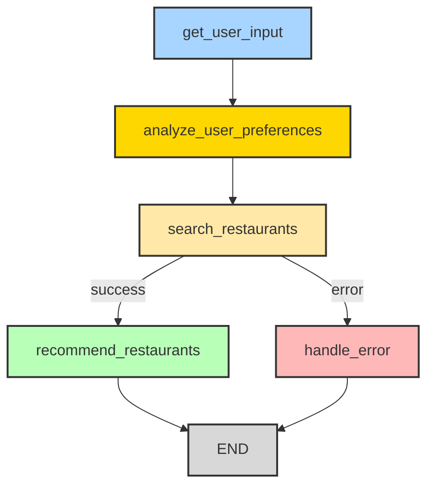

# 맛집 추천 에이전트

이 프로젝트는 사용자의 나이, 선호 음식, 날씨, 위치 등의 정보를 바탕으로 개인화된 맛집을 추천해주는 AI 에이전트입니다.

## 주요 기능

- **사용자 정보 수집**: 나이, 선호 음식, 날씨, 위치 입력
- **개인화된 선호도 분석**: 나이대별, 날씨별, 계절별 음식 선호도 패턴 분석
- **스마트 맛집 검색**: 네이버 API를 통한 실시간 맛집 검색
- **백업 검색 시스템**: API 실패 시 정적 데이터 기반 검색
- **AI 기반 개인화 추천**: OpenAI를 활용한 맞춤형 맛집 추천

## 개인화 분석 기능

### 나이대별 선호도 분석
- **10대**: 피자, 햄버거, 치킨, 아이스크림, 떡볶이
- **20대**: 카페, 분식, 치킨, 피자, 샐러드
- **30대**: 한식, 양식, 카페, 치킨, 피자
- **40대**: 한식, 양식, 중식, 일식, 카페
- **50대**: 한식, 중식, 일식, 양식, 전통음식
- **60대 이상**: 한식, 전통음식, 중식, 일식, 건강식

### 날씨별 음식 선호도
- **맑음**: 샐러드, BBQ, 피자, 아이스크림
- **흐림**: 국수, 스튜, 핫팟, 커피
- **비**: 국수, 스튜, 핫팟, 따뜻한 음식
- **눈**: 핫팟, 스튜, 따뜻한 국, 따뜻한 음료
- **더움**: 냉면, 샐러드, 아이스크림, 콜드브루
- **추움**: 핫팟, 스튜, 따뜻한 국, 따뜻한 음료

### 계절별 추천 음식
- **봄**: 나물, 딸기, 한우, 봄나물, 새싹채소
- **여름**: 냉면, 빙수, 콜드브루, 샐러드, 아이스크림
- **가을**: 게, 전복, 송이버섯, 단풍, 고구마
- **겨울**: 핫팟, 스튜, 따뜻한 국, 따뜻한 음료, 겨울나물

## 사용 기술

- **Python 3.10+**
- **LangChain**: AI 모델 통합 및 프롬프트 관리
- **LangGraph**: 워크플로우 및 상태 관리
- **OpenAI API**: 개인화된 추천 생성
- **Naver 검색 API**: 실시간 맛집 정보 검색

## 설치 방법

```bash
# 1. 저장소 클론
git clone <repository-url>
cd food_reco_agent

# 2. 필수 패키지 설치
pip install -r requirements.txt

# 3. 환경 변수 설정
cp .env-sample .env
# .env 파일을 편집하여 실제 API 키를 입력하세요
```

### API 키 설정

#### 필수 API 키
1. **OpenAI API 키**
   - [OpenAI Platform](https://platform.openai.com/api-keys)에서 발급
   - 개인화된 맛집 추천 생성에 사용

2. **네이버 검색 API**
   - [네이버 개발자 센터](https://developers.naver.com/apps/#/list)에서 애플리케이션 등록
   - 실시간 맛집 정보 검색에 사용

#### 선택사항 API 키
3. **Google Custom Search API** (현재 미사용)
   - [Google Cloud Console](https://developers.google.com/custom-search/v1/overview)에서 발급
   - 향후 Google 검색 기능 확장 시 사용 예정

### .env 파일 예시
```bash
# OpenAI API 설정
OPENAI_API_KEY=sk-1234567890abcdef1234567890abcdef1234567890abcdef

# 네이버 검색 API 설정
NAVER_CLIENT_ID=your_naver_client_id
NAVER_CLIENT_SECRET=your_naver_client_secret

# Google Custom Search API 설정 (선택사항)
GOOGLE_API_KEY=AIzaSyC1234567890abcdef1234567890abcdef123456
GOOGLE_CSE_ID=123456789012345678901:abcdefghijk
```

## 사용 방법

```bash
python src/main.py
```

프롬프트에 따라 다음 정보를 입력하세요:
1. **나이**: 숫자로 입력 (예: 25)
2. **선호 음식**: 원하는 음식 종류 (예: 한식, 피자, 치킨)
3. **날씨**: 현재 날씨 상태 (예: 맑음, 비, 흐림)
4. **지역**: 검색하고 싶은 지역 (예: 강남, 홍대, 부산)

## 워크플로우

아래는 맛집 추천 에이전트의 향상된 워크플로우를 시각적으로 표현한 다이어그램입니다:



### 워크플로우 단계별 설명

1. **사용자 입력 수집** (`get_user_input`)
   - 나이, 선호 음식, 날씨, 위치 정보 수집
   - 입력값 유효성 검사

2. **사용자 선호도 분석** (`analyze_user_preferences`)
   - 나이대별 선호도 패턴 분석
   - 날씨별 음식 선호도 매핑
   - 계절별 추천 음식 결정
   - 식이 고려사항 및 가격대 선호도 분석
   - 분위기 선호도 결정

3. **맛집 검색** (`search_restaurants`)
   - 네이버 API를 통한 실시간 맛집 검색
   - 검색 실패 시 정적 데이터 기반 백업 검색
   - 검색 결과 필터링 및 정리

4. **개인화 추천** (`recommend_restaurants`)
   - 사용자 프로필과 검색 결과를 종합 분석
   - OpenAI를 활용한 맞춤형 추천 생성
   - 대표 메뉴, 가격대, 분위기, 평점 포함

5. **에러 처리** (`handle_error`)
   - 검색 실패 또는 기타 오류 상황 처리
   - 사용자 친화적인 에러 메시지 제공

## 프로젝트 구조

```
food_reco_agent/
├── src/
│   ├── main.py              # 메인 애플리케이션 및 워크플로우
│   ├── naver_search.py      # 네이버 API 검색 기능
│   └── restaurant_data.py   # 정적 맛집 데이터
├── requirements.txt         # Python 의존성
├── pyproject.toml          # 프로젝트 설정
├── .env-sample             # 환경 변수 템플릿
└── README.md              # 프로젝트 문서
```

## 개인화 추천 예시

### 25세 사용자, 맑은 날씨, 한식 선호
- **나이대 분석**: 20대 선호도 (카페, 분식, 치킨, 피자, 샐러드)
- **날씨 분석**: 맑음 선호도 (샐러드, BBQ, 피자, 아이스크림)
- **추천 결과**: 한식과 20대 선호도를 고려한 트렌디한 한식 맛집 추천

### 45세 사용자, 비 오는 날씨, 양식 선호
- **나이대 분석**: 40대 선호도 (한식, 양식, 중식, 일식, 카페)
- **날씨 분석**: 비 선호도 (국수, 스튜, 핫팟, 따뜻한 음식)
- **추천 결과**: 따뜻한 양식과 40대 선호도를 고려한 고급스러운 맛집 추천

## 라이선스

이 프로젝트는 MIT 라이선스 하에 배포됩니다.