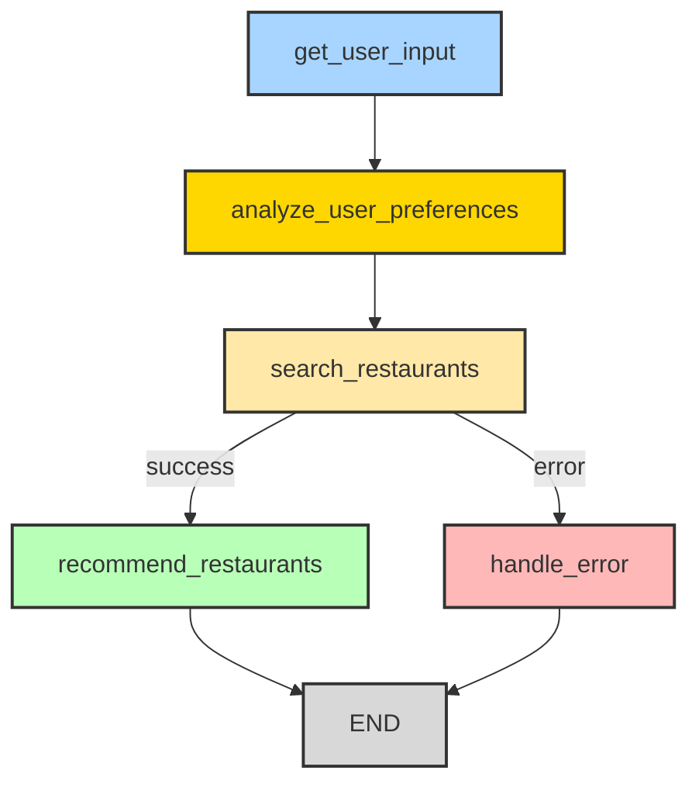

# 맛집 추천 에이전트

이 프로젝트는 사용자의 나이, 선호 음식, 날씨, 위치, 동반자유형, 분위기, 특별 요구사항 등의 정보를 바탕으로 개인화된 맛집을 추천해주는 AI 에이전트입니다.

## 주요 기능

- **사용자 정보 수집**: 나이, 선호 음식, 날씨, 위치, 동반자유형, 분위기, 특별 요구사항 입력
- **개인화된 선호도 분석**: 나이대별, 날씨별, 계절별 음식 선호도 패턴 분석
- **스마트 맛집 검색**: 네이버 API를 통한 실시간 맛집 검색 (사용자 프로필 기반)
- **백업 검색 시스템**: API 실패 시 정적 데이터 기반 검색
- **AI 기반 개인화 추천**: Google Gemini를 활용한 맞춤형 맛집 추천

## 개인화 분석 기능

### 나이대별 선호도 분석
- **고등학생 이하 (18세 이하)**: 피자, 햄버거, 치킨, 아이스크림, 떡볶이, 분식
- **대학생 (19-25세)**: 카페, 분식, 치킨, 피자, 샐러드, 한식
- **직장인 (26-50세)**: 한식, 양식, 카페, 치킨, 피자, 중식, 일식
- **중년 (51세 이상)**: 한식, 전통음식, 중식, 일식, 양식, 건강식

### 날씨별 음식 선호도
- **맑음**: BBQ, 피자, 치킨, 샐러드, 아이스크림, 카페
- **흐림**: 국수, 스튜, 핫팟, 커피, 따뜻한 음식
- **비**: 국수, 스튜, 핫팟, 따뜻한 국, 커피, 따뜻한 음식
- **눈**: 핫팟, 스튜, 따뜻한 국, 따뜻한 음료, 커피
- **더움**: 냉면, 샐러드, 아이스크림, 콜드브루, 빙수, 냉국
- **추움**: 핫팟, 스튜, 따뜻한 국, 따뜻한 음료, 커피, 따뜻한 음식

### 계절별 추천 음식
- **봄**: 나물, 딸기, 한우, 봄나물, 새싹채소
- **여름**: 냉면, 빙수, 콜드브루, 샐러드, 아이스크림
- **가을**: 게, 전복, 송이버섯, 단풍, 고구마
- **겨울**: 핫팟, 스튜, 따뜻한 국, 따뜻한 음료, 겨울나물

## 사용 기술

- **Python 3.10+**
- **LangGraph**: 워크플로우 및 상태 관리
- **Google Gemini API**: 개인화된 추천 생성
- **Naver 검색 API**: 실시간 맛집 정보 검색

## 설치 방법

```bash
# 1. 저장소 클론
git clone <repository-url>
cd food_reco_agent

# 2. 필수 패키지 설치
uv sync

# 3. 환경 변수 설정
cp .env-sample .env
# .env 파일을 편집하여 실제 API 키를 입력하세요
```

### API 키 설정

#### 필수 API 키
1. **Google Gemini API 키**
   - [Google AI Studio](https://makersuite.google.com/app/apikey)에서 발급
   - 개인화된 맛집 추천 생성에 사용

2. **네이버 검색 API**
   - [네이버 개발자 센터](https://developers.naver.com/apps/#/list)에서 애플리케이션 등록
   - 실시간 맛집 정보 검색에 사용

#### 선택사항 API 키
3. **Google Custom Search API** (현재 미사용)
   - [Google Cloud Console](https://developers.google.com/custom-search/v1/overview)에서 발급
   - 향후 Google 검색 기능 확장 시 사용 예정

### .env 파일 예시
```bash
# Google Gemini API 설정
GOOGLE_API_KEY=AIzaSyC1234567890abcdef1234567890abcdef123456

# 네이버 검색 API 설정
NAVER_CLIENT_ID=your_naver_client_id
NAVER_CLIENT_SECRET=your_naver_client_secret

# Google Custom Search API 설정 (선택사항)
GOOGLE_CSE_ID=123456789012345678901:abcdefghijk
```

## 사용 방법

### 1. CLI 모드 (기존 방식)
```bash
python run_app.py
```

### 2. 웹 인터페이스 (새로운 방식)
```bash
# FastAPI 서버 실행
python run_web.py  # 선택 1

# Streamlit 웹 앱 실행 (별도 터미널)
python run_web.py  # 선택 2
```

### 3. 직접 실행
```bash
# FastAPI 서버
python -m uvicorn src.api.main:app --reload

# Streamlit 앱
python -m streamlit run src/web/streamlit_app.py
```

### 4. React 프론트엔드 실행 (웹 화면)
```bash
# 새 터미널에서 프론트엔드 실행
cd frontend
npm install
npm run dev

# 브라우저에서 접속
# http://localhost:3000
```

> 백엔드는 http://localhost:8000 에서 실행 (다른 터미널에서 `python -m src.api.main`)

## 워크플로우



### 워크플로우 단계별 설명

1. **사용자 입력 수집** (`get_user_input`)
   - 나이, 선호 음식, 날씨, 위치, 동반자유형, 분위기, 특별 요구사항 정보 수집
   - 입력값 유효성 검사

2. **사용자 선호도 분석** (`analyze_user_preferences`)
   - 나이대별 선호도 패턴 분석 (고등학생 이하, 대학생, 직장인, 중년)
   - 날씨별 음식 선호도 매핑
   - 계절별 추천 음식 결정
   - 사용자 프로필 생성

3. **맛집 검색** (`search_restaurants`)
   - 사용자 프로필 기반 네이버 API 실시간 맛집 검색
   - 검색 실패 시 정적 데이터 기반 백업 검색
   - 검색 결과 필터링 및 정리

4. **개인화 추천** (`recommend_restaurants`)
   - 사용자 프로필과 검색 결과를 종합 분석
   - Google Gemini를 활용한 맞춤형 추천 생성
   - 대표 메뉴, 가격대, 분위기, 평점, 동반자유형 적합성, 특별 요구사항 만족도 포함

5. **에러 처리** (`handle_error`)
   - 검색 실패 또는 기타 오류 상황 처리
   - 사용자 친화적인 에러 메시지 제공

## 프로젝트 구조

```
food_reco_agent/
├── frontend/           # React 프론트엔드 (Vite + TypeScript + Tailwind)
├── src/
│   ├── api/                # FastAPI 웹 서버
│   │   ├── __init__.py
│   │   └── main.py         # API 엔드포인트
│   ├── web/                # 웹 인터페이스
│   │   ├── __init__.py
│   │   └── streamlit_app.py # Streamlit 웹 앱
│   ├── core/               # 핵심 워크플로우
│   │   ├── __init__.py
│   │   ├── graph.py        # LangGraph 워크플로우
│   │   ├── graph_types.py  # 상태 타입 정의
│   │   └── nodes.py        # 워크플로우 노드들
│   ├── database/           # 데이터베이스 관련
│   │   ├── __init__.py
│   │   ├── connection.py   # DB 연결
│   │   ├── models.py       # SQLAlchemy 모델
│   │   ├── queries.py      # 쿼리 함수들
│   │   └── storage_service.py # 저장 서비스
│   ├── services/           # 외부 서비스
│   │   ├── __init__.py
│   │   ├── naver_search.py # 네이버 API 검색
│   │   └── restaurant_data.py # 정적 맛집 데이터
│   └── utils/              # 유틸리티
│       └── __init__.py
├── tests/                  # 테스트 코드
│   ├── __init__.py
│   ├── test_api.py         # API 테스트
│   ├── test_core.py        # 코어 모듈 테스트
│   └── test_database.py    # 데이터베이스 테스트
├── run_app.py              # CLI 실행 스크립트
├── create_tables.py        # DB 테이블 생성
├── requirements.txt        # Python 의존성
├── pyproject.toml         # 프로젝트 설정
├── .env-sample            # 환경 변수 템플릿
└── README.md             # 프로젝트 문서
```

## 프론트엔드(`frontend`) 상세 가이드

### 요구 사항
- **Node.js 18+**, **npm**
- 백엔드 API 서버 실행: `python -m src.api.main` (기본 `http://localhost:8000`)

### NPM 스크립트
- **dev**: Vite 개발 서버 실행 (HMR). 기본 포트: 3000 → `npm run dev`
- **build**: TypeScript 체크 후 Vite 프로덕션 빌드 → `npm run build` (산출물: `frontend/dist/`)
- **preview**: 로컬에서 빌드 결과 미리보기 → `npm run preview`
- **lint**: ESLint 실행 → `npm run lint`

### 디렉토리/파일 설명
- **`frontend/index.html`**: 루트 HTML 템플릿. `#root`에 React가 마운트됩니다.
- **`frontend/vite.config.ts`**: Vite 설정. 개발 포트(기본 3000), 선택적 프록시(`/api` → `http://localhost:8000`) 포함.
- **`frontend/tailwind.config.js`**, **`frontend/postcss.config.js`**: Tailwind/PostCSS 설정.
- **`frontend/tsconfig.json`**, **`frontend/tsconfig.node.json`**: TypeScript 설정.
- **`frontend/src/main.tsx`**: 앱 진입점. `App`을 DOM에 마운트.
- **`frontend/src/App.tsx`**: 전체 레이아웃과 상태 관리. API 헬스체크, 폼 제출, 로딩/오류/결과 표시.
- **`frontend/src/index.css`**: Tailwind 지시어 및 공통 유틸리티 클래스 정의.
- **`frontend/src/services/api.ts`**: 백엔드 통신 유틸. `GET /health`, `POST /recommend` 호출.
- **`frontend/src/types/index.ts`**: 요청/응답/도메인 타입 정의.
- **`frontend/src/components/*`**: 화면 구성 요소 모음.
  - **`Header.tsx`**: 상단 바.
  - **`ApiStatus.tsx`**: API 연결 상태 배지.
  - **`LoadingSpinner.tsx`**: 로딩 상태 표시.
  - **`RecommendationForm.tsx`**: 입력 폼(나이/선호/날씨/지역/동반자/분위기/요구사항).
  - **`RecommendationResults.tsx`**: 사용자 프로필/검색 결과/AI 추천/세션 정보 표시.

### 실행/빌드
1. 개발 실행
   ```bash
   cd frontend
   npm install
   npm run dev
   # http://localhost:3000
   ```
2. 프로덕션 빌드/미리보기
   ```bash
   npm run build
   npm run preview
   # 기본 http://localhost:4173
   ```